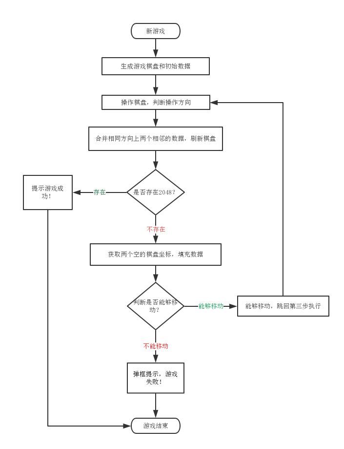

# MiniProgram-2048
小程序版本的2048。

### 项目目录

```
-project
    |--pages  项目页面目录
    |--tools  工具类目录
    |   |--GameManager.js 游戏主要控制文件
    |   |--Grid.js 游戏棋盘控制文件
    |   |--Tile.js  游戏数据控制文件
    |--app.js 项目主文件
    |--app.json 小程序主配置文件
    |--app.wxss 项目公共样式库文件
    |--LICENSE 开源license文件
    |--project.config.json 小程序项目配置文件
```

### 思路

1. 生成游戏棋盘
2. 随机填充两个数据
3. 操作棋盘，判断手势操作方向
4. 合并操作方向上相邻两个相同的数据，并重新赋值棋盘数据
5. 判断是否存在2048的数据，存在提示游戏获胜，不存在继续下一步
6. 获取两个空的棋盘格坐标，随机填充两个棋盘格
7. 判断是否能够移动（能够移动执行下一步，不能移动提示游戏结束，弹出弹框）
8. 监听手势操作，跳回步骤4顺序执行

